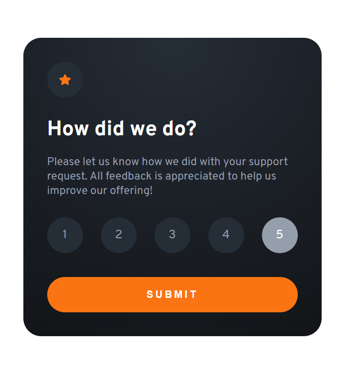

# Frontend Mentor - Interactive rating component solution

This is a solution to the [Interactive rating component challenge on Frontend Mentor](https://www.frontendmentor.io/challenges/interactive-rating-component-koxpeBUmI). Frontend Mentor challenges help you improve your coding skills by building realistic projects.

## Table of contents

- [Overview](#overview)
  - [The challenge](#the-challenge)
  - [Screenshot](#screenshot)
  - [Links](#links)
- [My process](#my-process)
  - [Built with](#built-with)
  - [What I learned](#what-i-learned)
  - [Continued development](#continued-development)
  - [Useful resources](#useful-resources)
- [Author](#author)
- [Acknowledgments](#acknowledgments)

## Overview

### The challenge

Users should be able to:

- View the optimal layout for the app depending on their device's screen size
- See hover states for all interactive elements on the page
- Select and submit a number rating
- See the "Thank you" card state after submitting a rating

### Screenshot



### Links

- Solution URL: [https://github.com/Poomcha/frontendmentor-interactiveratingcomponent.git]
- Live Site URL: [https://poomcha.github.io/frontendmentor-interactiveratingcomponent/]

## My process

### Built with

- Semantic HTML5 markup
- CSS custom properties
- Flexbox
- Mobile-first workflow
- [Vue](https://vuejs.org/) - JS Framework

### What I learned

Displaying customs radio buttons :

```css
.rating-radio-btn {
  display: none;
}

.rating-radio-btn + .rating-label {
  width: 100%;
  height: 100%;
  margin: auto;
  cursor: pointer;
  border-radius: 100%;
  background-color: hsl(213, 19%, 18%);
  display: flex;
  color: hsl(217, 12%, 63%);
}
.rating-radio-btn + .rating-label:hover {
  background-color: hsl(25, 97%, 53%);
}

.rating-radio-btn + .rating-label span {
  margin: auto;
}

.rating-radio-btn + .rating-label:hover span {
  color: hsl(0, 0%, 100%);
}
.rating-radio-btn:checked + .rating-label {
  background-color: hsl(217, 12%, 63%);
}

.rating-radio-btn:checked + .rating-label span {
  color: hsl(0, 0%, 100%);
}
```

### Continued development

### Useful resources

- [Styling Radios Buttons](https://www.sliderrevolution.com/resources/styling-radio-buttons/) - This helped me for styling the radios buttons. I really liked this pattern and will use it going forward.

## Author

- Website - [My Github](https://github.com/Poomcha)
- Frontend Mentor - [@poomcha](https://www.frontendmentor.io/profile/poomcha)

## Acknowledgments
